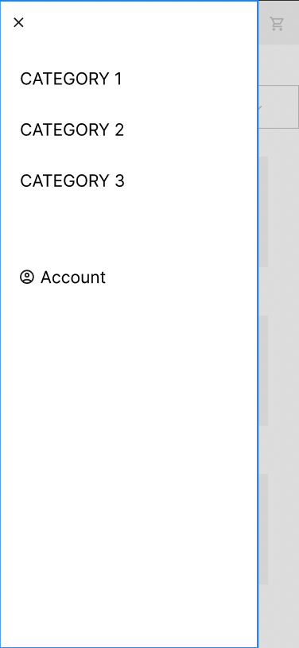

# Project Pitch

## Description

A basic e-commerce website, allowing customers to browse, filter, and search for products, add products to a cart, and checkout. There will be a admin dashboard for managing products, orders, and users.

The goal of this project is to continue practicing making a full stack MERN application, while also learning new technologies.

I have some familiarity with Typescript and would like to dive deeper by creating a whole application with it. I'd also like to practice Test Driven Development as well as integrating with third-party APIs, such as Stripe.

## Technology

- MongoDb, Express, React, Node
- Backend and frontend written in **TypeScript**.
- Follow a **TDD** approach, using **Jest** for unit testing and **Storybook** for visual testing.
- Stretch goal technologies:
  - APIs: **Stripe**, **Twilio**
  - Progressive Web App (**PWA**)

## Potential Roadblocks

- Learning TypeScript might take a long time
- Using Jest and Storybook for testing might take a long time

## User Stories

- MVP:
  - As a customer, I want to browse products and add them to a cart.
  - As a customer, I want to be able to search for a specific product, or filter and sort the products by price, name, or category.
  - As a customer, I want to checkout and pay for my cart.
  - As a customer, I want to be able to rate and review products.
  - As an admin, I want to be able to add, edit, and delete products.
- Stretch Goals:
  - As a customer, I want to see a list of my previous orders.
  - As a customer, I want to be able to see if an item is in stock.
  - As a customer, I want to receive a notification (by email or SMS) confirming my order.
  - As a customer, I want to be able to receive a notification when a product is back in stock.
  - As a customer, I want to be able to add a product to my wishlist.
  - As an admin, I want to be able to add, edit, and delete categories.
  - As an admin, I want to be able to see sales reports.
  - As an admin, I want to receive notifications when a new order is placed.
  - As an admin, I want to be able to view all orders.
  - As an admin, I want to receive a notification when an item is out of stock.

## Database Schema

```
{
  "User": {
    "_id": "ObjectId",
    "name": "String",
    "email": "String",
    "password_hash": "String",
    "cart": [
      {
        "productId": "ObjectId",
        "quantity": Number
      }
    ]
  },
  "Product": {
    "_id": "ObjectId",
    "title": "String",
    "price": Number,
    "description": "String",
    "image_url": "String"
    "inventoryQuantity": Number
    "category": "String"
    "reviews": [
      {
        "userId": "ObjectId",
        "rating": Number,
        "comment": "String"
      }
    ]
  },
  "Order": {
    "_id": "ObjectId",
    "userId": "ObjectId",
    "products": [
      {
        "productId": "ObjectId",
        "quantity": Number,
        "price": Number
      }
    ],
    "payment": {
      "paymentId": "String",
      "amount": Number,
      "date": "Date"
    },
  },
}
```

## API Routes

```
GET /api/products
GET /api/products/:id
POST /api/products
PUT /api/products/:id
DELETE /api/products/:id

GET /api/users
GET /api/users/:id
POST /api/users
PUT /api/users/:id
DELETE /api/users/:id

GET /api/orders
GET /api/orders/:id
POST /api/orders
PUT /api/orders/:id
DELETE /api/orders/:id

GET /api/cart
GET /api/cart/:id
POST /api/cart
PUT /api/cart/:id
DELETE /api/cart/:id

POST /api/products/:id/reviews
PUT /api/products/:id/reviews/:id
DELETE /api/products/:id/reviews/:id
```

## Wireframes





