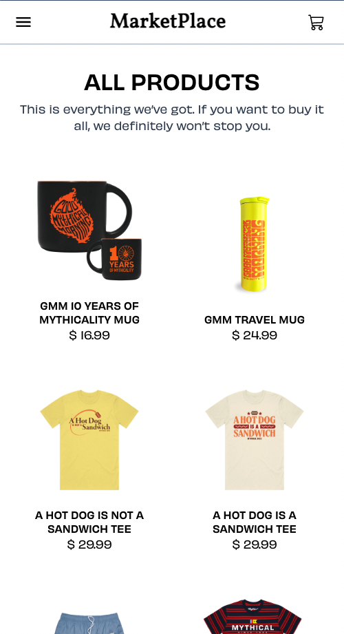
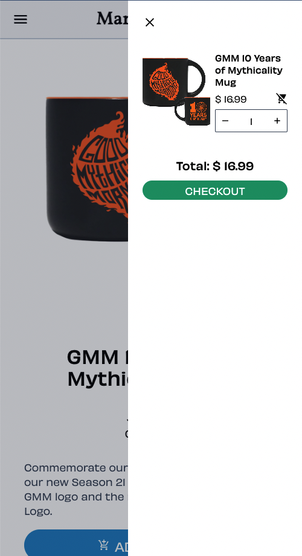
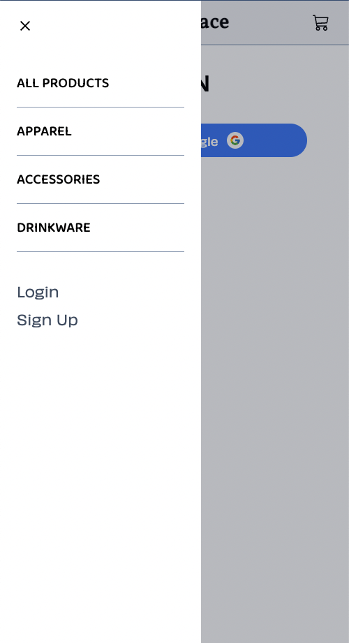
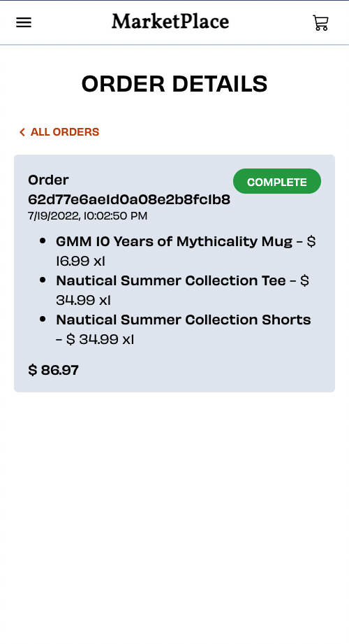
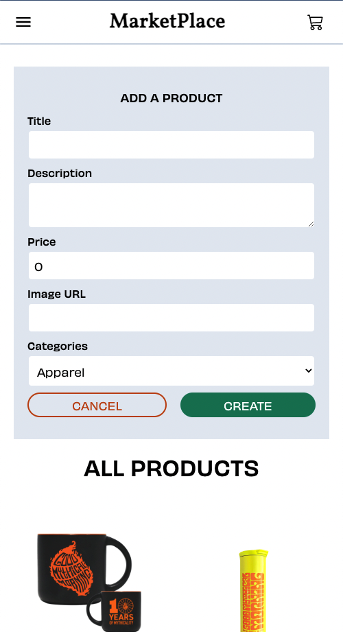
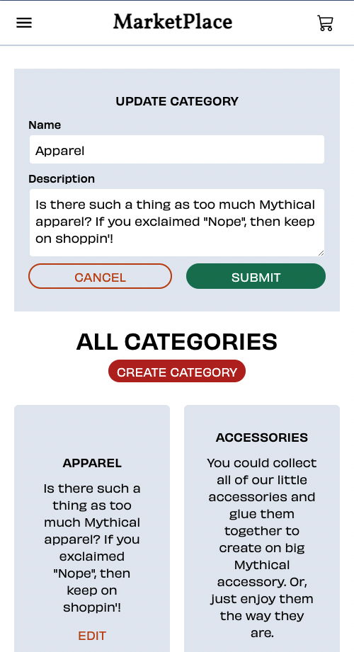
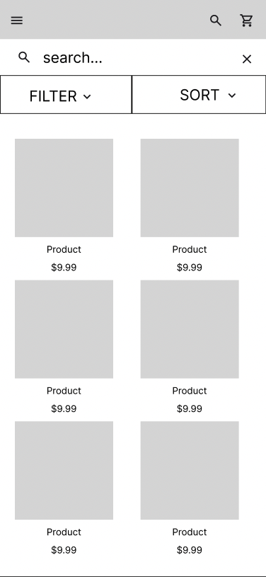
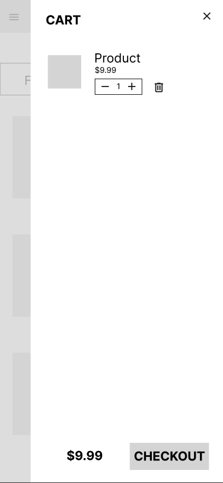
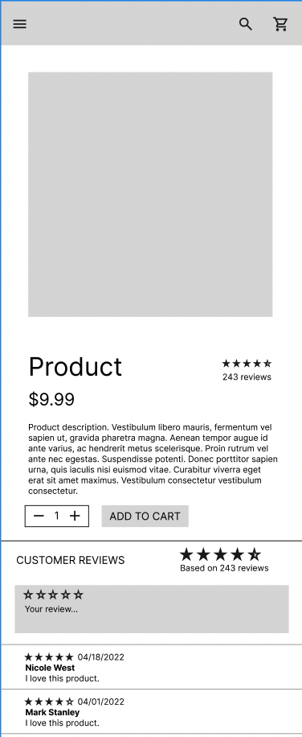

# MarketPlace

MarketPlace is an e-commerce website allowing users to browse for goods, add
items to a cart, and checkout. Users are able to securely login with a Google
account, and their cart is saved so that they can continue shopping on any
device without losing their cart. Checkout is handled by Stripe, allowing users
to pay for their order with a credit card.

<p align="center">
  
</p>

<details>
  <summary>
    <b>More screenshots</b>
  </summary>
  <div align="center">
    
    
    
    
    
    
    
  </div>
</details>

## Overview

This project was a learning opportunity for me to tackle a new language
(TypeScript), practice integrating with third-party APIs (Firebase Auth &
Stripe), and practice using the Jest testing framework.

### **Hurdles**

A large portion of the six days devoted to this project were spent learning
TypeScript, and practicing testing with Jest. Though a lot of what I learned
during this project didn't make it into the final product due to the time
constraints, I'm proud to have completed a functional application
in a short amount of time.

Learning TypeScript was a challenge, even given my familiarity with JavaScript.
A lot of time was spent figuring out the best compiler options, and learning how
to use third party libraries libraries with TypeScript. Since most documentation
and guides for libraries is written for JavaScript, it took some time to
translate those into TypeScript and debug when I ran into type-checking issues.

### **Unsolved Issues**

- Product reviews are fully implemented on the backend, and are shown on the
  product page, but I didn't have time to implement review creation on the
  frontend.
- While I did learn Jest and Storybook, I didn't have time to meaningfully test
  the application. Most of the UI components have Storybook stories, but the other components do not.
- I didn't integrate Twillio with the application to send notifications to users.

## Technology

- New technologies:
  - **TypeScript** for both front-end and back-end.
  - **Jest** for testing.
  - **Storybook** for visual / UI testing.
- APIs:
  - **Stripe** for payment processing.
  - **Firebase Auth** for user authentication (Sign in with Google).
- Familiar technology
  - MongoDb
  - Express
  - React
  - Node
  - React Router
  - TailwindCSS

## User Stories

- Completed:
  - [x] As a customer, I want to browse products and add them to a cart.
  - [x] As a customer, I want to be able to filter products by category.
  - [x] As a customer, I want to be able to checkout and pay for my cart.
  - [x] As a customer, I want to see a list of my previous orders.
  - [x] As a customer, I want to be able to login with a Google account.
  - [x] As a customer, I want my cart to be saved so that I can continue
        shopping later on any device without losing my cart.
  - [x] As an admin, I want to be able to add, edit, and delete products.
  - [x] As an admin, I want to be able to add, edit, and delete categories.
  - [x] As an admin, I want to be able to see all order.
- Still to come:
  - [ ] As a customer, I want to be able to rate and review products.
  - [ ] As a customer, I want to be able to search for a specific product, or
        filter and sort the products by price, name, or category.
  - [ ] As a customer, I want to be able to receive a notification when a
        product is back in stock.
  - [ ] As a customer, I want to be able to add a product to my wishlist.
  - [ ] As an admin, I want to be able to see sales reports.
  - [ ] As an admin, I want to receive notifications when a new order is placed.
  - [ ] As an admin, I want to receive a notification when an item is out of
        stock.

## Wireframes

<div align="center">
  
  
  
  
</div>

<!-- 


 -->

## Database Schema

```
{
  "User": {
    "_id": "ObjectId",
    "name": "String",
    "cart": [
      {
        "product": "ObjectId",
        "quantity": Number
      }
    ],
    "role": "ADMIN" | "CUSTOMER",
  },
  "Product": {
    "_id": "ObjectId",
    "title": "String",
    "price": Number,
    "description": "String",
    "image_url": "String"
    "inventoryQuantity": Number
    "category": "ObjectId",
    "reviews": [
      {
        "userId": "ObjectId",
        "rating": Number,
        "comment": "String"
      }
    ]
  },
  "Category": {
    "_id": "ObjectId",
    "title": "String",
    "description": "String",
  },
  "Order": {
    "_id": "ObjectId",
    "userId": "ObjectId",
    "products": [
      {
        "product": "ObjectId",
        "quantity": Number,
        "price": Number
      }
    ],
    "stripeSessionId": "String",
  },
}
```

## API Routes

```
GET /api/products
GET /api/products/:id
GET /api/products/category/:categoryId
POST /api/products
PUT /api/products/:id
DELETE /api/products/:id

GET /api/categories
GET /api/categories/:id
POST /api/categories
PUT /api/categories/:id
DELETE /api/categories/:id

GET /api/users
GET /api/users/:id
POST /api/users
PUT /api/users/:id
DELETE /api/users/:id
POST /api/users/login
GET /api/users/validate

GET /api/orders
GET /api/orders/:id
GET /api/orders/user/:userId
DELETE /api/orders/:id

GET /api/cart
PUT /api/cart/:id

GET /api/checkout/session
POST /api/checkout/create-session

POST /api/products/:id/reviews
PUT /api/products/:id/reviews/:id
DELETE /api/products/:id/reviews/:id
```

## Installation Instructions

- **Server:**
  - Fork and clone the
    [server repository](https://github.com/saulthebear/ecommerce-server).
  - Install dependencies with `yarn`.
  - Create a new firebase project, with Auth enabled and Google as a sign-in
    provider.
    - Add a `serviceAccountKey.json` file to `src/config/` containing your
      firebase configuration.
    - It should look like this:
      ```json
      {
        "type": "service_account",
        "project_id": "...",
        "private_key_id": "...",
        "private_key": "...",
        "client_email": "...",
        "client_id": "...",
        "auth_uri": "https://accounts.google.com/o/oauth2/auth",
        "token_uri": "https://www.googleapis.com/oauth2/v1/certs",
        "auth_provider_x509_cert_url": "...",
        "client_x509_cert_url": "..."
      }
      ```
    - To run Firebase Auth in emulator mode, run `firebase emulators:start`.
  - Create a stripe account, and get your public and private keys.
  - Add the following environment variables to a `.env` file in the root
    directory:
    - `PORT=5000`
    - `HOST=localhost`
    - `CLIENT_URL=<client url>`
    - `MONGO_DB_CONNECTION_STRING=<mongo db connection string>`
    - `STRIPE_SECRET_KEY=<stripe secret key>`
    - `STRIPE_PUBLISHABLE_KEY=<stripe publishable key>`
  - Run the server with `yarn dev`.
- **Client:**
  - Fork and clone this repository.
  - Add the following environment variables to a `.env.local` file in the root
    directory:
    - `REACT_APP_FIREBASE_API_KEY=<firebase api key>`
    - `REACT_APP_FIREBASE_AUTH_DOMAIN=<firebase auth domain>`
    - `REACT_APP_FIREBASE_PROJECT_ID=<firebase project id>`
    - `REACT_APP_FIREBASE_STORAGE_BUCKET=<firebase storage bucket>`
    - `REACT_APP_FIREBASE_MESSAGING_SENDER_ID=<firebase messaging sender id>`
    - `REACT_APP_FIREBASE_APP_ID=<firebase app id>`
    - `REACT_APP_FIREBASE_MEASUREMENT_ID=<firebase measurement id for analytics>`
    - `REACT_APP_SERVER_URL=<url of running server>`
  - Install dependencies with `yarn`.
  - Run `yarn start`.
